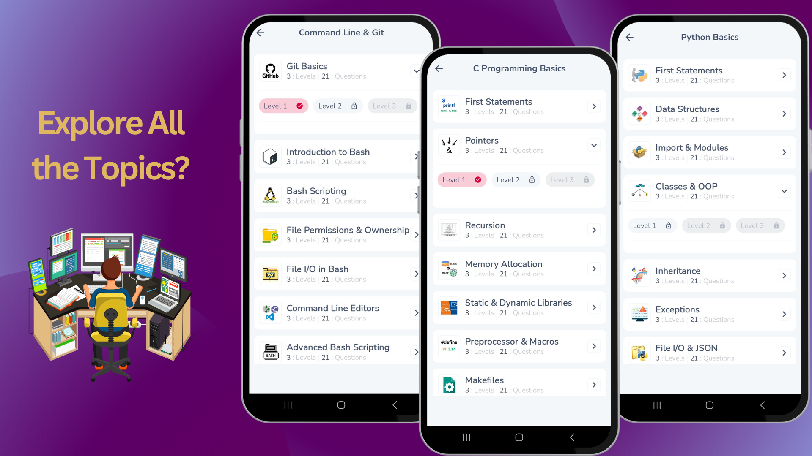
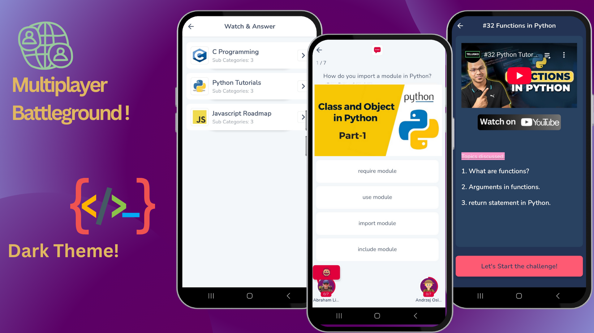
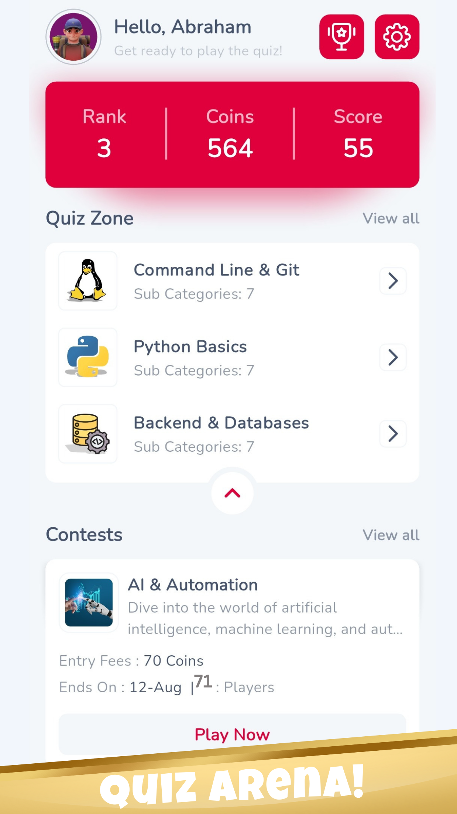
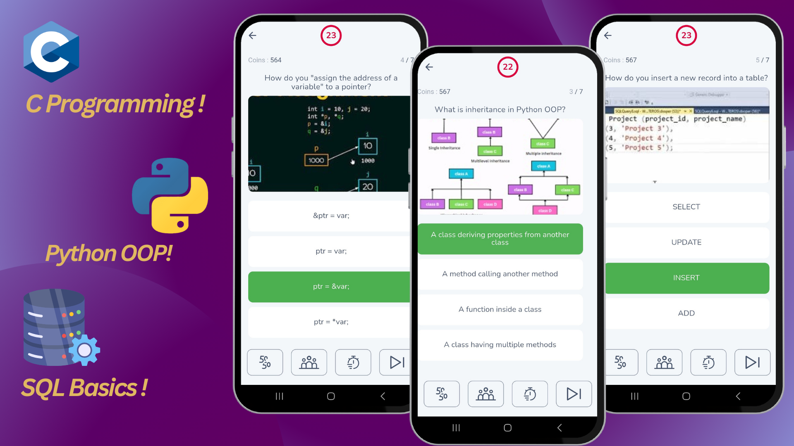
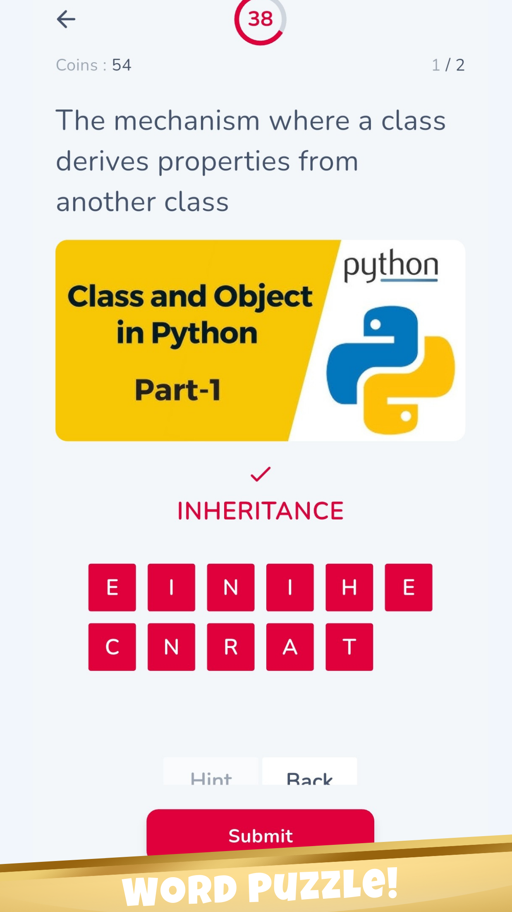
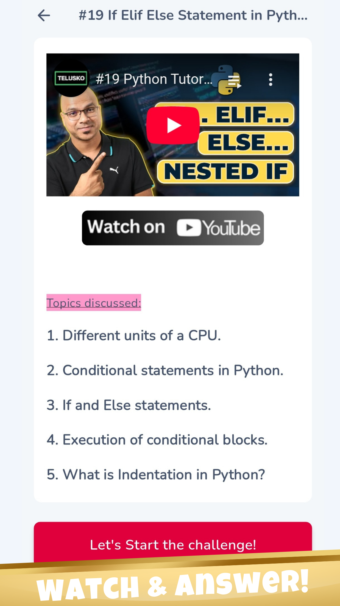

# Elite Quiz — Flutter App

Compact README for the Elite Quiz project. Use this as the canonical starting point for development, testing and releases.

App Video Previews:  
[Programmin Quiz App](https://youtu.be/L1SAxGsNOrA)  
[Language Quiz App](https://youtu.be/_7fr9AZl5RE)

<h2></h2>

<h2></h2>

<h2></h2>

## Quick overview

Elite Quiz is a Flutter-based mobile quiz app supporting:

- Multiple quiz types (single/multiplayer, guess-the-word, audio, LaTeX support)
- Battle rooms and matchmaking
- Wallet, redeem & coin history
- Firebase-backed auth, messaging and analytics
- In-app purchases & ads

Project entry points:

- App bootstrap: [lib/main.dart](lib/main.dart)
- App wiring & DI: [lib/app/app.dart](lib/app/app.dart)
- Routes: [lib/app/routes.dart](lib/app/routes.dart)

---

## Features (where implemented)

- Firebase initialization: [`DefaultFirebaseOptions.currentPlatform`](lib/firebase_options.dart) — see [lib/firebase_options.dart](lib/firebase_options.dart)
- Push notifications & foreground handling: [lib/ui/screens/home/home_screen.dart](lib/ui/screens/home/home_screen.dart)
- Authentication repository: [lib/features/auth/auth_repository.dart](lib/features/auth/auth_repository.dart)
- Profile management & uploads: [lib/features/profile_management/profile_management_repository.dart](lib/features/profile_management/profile_management_repository.dart) and [lib/features/profile_management/profile_management_remote_data_source.dart](lib/features/profile_management/profile_management_remote_data_source.dart)
- Theme management: [`ThemeCubit`](lib/ui/styles/theme/theme_cubit.dart) — [lib/ui/styles/theme/theme_cubit.dart](lib/ui/styles/theme/theme_cubit.dart)
- Lifelines / 50:50 logic: [`LifeLineOptions.getFiftyFiftyOptions`](lib/utils/lifeline_options.dart) — [lib/utils/lifeline_options.dart](lib/utils/lifeline_options.dart)
- Questions rendering and LaTeX: [lib/ui/widgets/questions_container.dart](lib/ui/widgets/questions_container.dart)
- Wallet UI + cancel dialog: [lib/ui/screens/wallet/wallet_screen.dart](lib/ui/screens/wallet/wallet_screen.dart) and [lib/ui/screens/wallet/widgets/cancel_redeem_request_dialog.dart](lib/ui/screens/wallet/widgets/cancel_redeem_request_dialog.dart)
- Image pick & crop (profile): [lib/ui/screens/profile/create_or_edit_profile_screen.dart](lib/ui/screens/profile/create_or_edit_profile_screen.dart)
- Misc UI helpers: [lib/utils/ui_utils.dart](lib/utils/ui_utils.dart)

Platform files:

- iOS App delegate additions: [ios/Runner/AppDelegate.swift](ios/Runner/AppDelegate.swift)
- Android Firebase config: [android/app/google-services.json](android/app/google-services.json)

---

## Skills & Impact — what this project demonstrates

This project is a compact portfolio piece that highlights practical, production-oriented Flutter skills:

- Flutter & Dart expertise
  - Large modular codebase organized by feature under `lib/features/*`
  - Custom widgets and responsive UI under `lib/ui/widgets/` and `lib/ui/screens/`
- State management & architecture
  - BLoC / Cubit pattern usage across features (see `lib/features/*/cubits/`)
  - Clear separation: repositories → data sources → cubits → UI
- Backend & realtime integration
  - Firebase Auth, Firestore, Messaging, Analytics integration (`lib/firebase_options.dart`)
  - Offline/local caching (Hive + local datasources)
- Monetization & growth features
  - Ads (Google Mobile Ads, Unity) + in-app purchases (Android/iOS)
- Media & advanced content
  - LaTeX rendering, audio playback, PDF viewing, webviews and YouTube embedding
- UX, accessibility & internationalization
  - Theme handling, localization cubits, validators and UI utils
- DevOps & release practices
  - pubspec release note: Release Version: 2.2.6 (kept in repo)
  - Launcher icons and platform config included
- Testing & maintainability
  - Project structured for unit/widget tests (add tests under `test/`)
  - Linting and analysis presets in dev_dependencies

How these map to repo files (examples)

- Auth flows: `lib/features/auth/*`
- Quiz engine & models: `lib/features/quiz/*`
- Matchmaking / Battle rooms: `lib/features/battle_room/*`
- Ads & monetization: `lib/features/ads/*`, `lib/features/in_app_purchase/*`
- Utilities: `lib/utils/*` (encryption, validators, connectivity)

---

## Getting started (dev)

Prereqs

- Flutter SDK (see `pubspec.yaml` environment: `sdk: '>=3.6.0 <4.0.0'`)
- Xcode for iOS, Android SDK (Windows/Android Studio) for Android

Windows quick setup

```bash
flutter pub get
flutter run -d <device-id>
```

Build

```bash
flutter build apk --release
flutter build ios --release  # run on macOS
```

Firebase

- `lib/firebase_options.dart` contains generated options.
- Ensure platform files:
  - Android: `android/app/google-services.json`
  - iOS: add `GoogleService-Info.plist` to Xcode project

Notes

- See `pubspec.yaml` for plugin list and version constraints (key deps: firebase\_\*, flutter_bloc, google_mobile_ads, in_app_purchase, hive_flutter, flutter_tex, just_audio).
- Add required platform permissions for camera, storage, notifications in AndroidManifest / Info.plist.

---

## Project meta (from pubspec.yaml)

- app id & name: flutterquiz
- version: 1.0.0+3
- Release Version tag (kept in repo): 2.2.6
- SDK constraint: >=3.6.0 <4.0.0

Selected dependencies (high level)

- Firebase: firebase_core, firebase_auth, firebase_messaging, cloud_firestore, firebase_analytics
- State & UI: flutter_bloc, google_fonts, flutter_svg
- Media & rendering: just_audio, flutter_tex, flutter_pdfview, youtube_player_flutter
- Ads & monetization: google_mobile_ads, unity_ads_plugin, in_app_purchase
- Storage & utils: hive_flutter, shared_preferences, http, image_picker, image_cropper

---

## Folder map (key locations)

- App wiring: `lib/app/app.dart`, `lib/app/routes.dart`
- Features: `lib/features/` (auth, quiz, battle_room, profile_management, wallet, ads, etc.)
- UI: `lib/ui/screens/` and `lib/ui/widgets/`
- Utils: `lib/utils/` (helpers, encryption, networking)

---

## Images / Screenshots (placeholders)

Place screenshots into `assets/images/screenshots/` and reference below:

<p>App home:</p>


---

<p>Quiz play:</p>


---

<p>Guess The Word:</p>


---

<p>Watch Video and Answer:</p>


Add images to repo and commit.

---

## Testing

- Unit / widget tests: add under `test/` and run:

```bash
flutter test
```

---

## Contributing

- Follow semantic commit hooks in `.githooks/commit-msg`.
- Keep features modular in `lib/features/*`.
- Register new UI screens in `lib/app/routes.dart`.

---

## Useful links in this repo

- Main: [lib/main.dart](lib/main.dart)
- App: [lib/app/app.dart](lib/app/app.dart)
- Routes: [lib/app/routes.dart](lib/app/routes.dart)
- Firebase options: [lib/firebase_options.dart](lib/firebase_options.dart)
- Theme state: [`ThemeCubit`](lib/ui/styles/theme/theme_cubit.dart) — [lib/ui/styles/theme/theme_cubit.dart](lib/ui/styles/theme/theme_cubit.dart)
- Lifeline helper: [`LifeLineOptions.getFiftyFiftyOptions`](lib/utils/lifeline_options.dart) — [lib/utils/lifeline_options.dart](lib/utils/lifeline_options.dart)
- Home screen: [lib/ui/screens/home/home_screen.dart](lib/ui/screens/home/home_screen.dart)
- Profile editor: [lib/ui/screens/profile/create_or_edit_profile_screen.dart](lib/ui/screens/profile/create_or_edit_profile_screen.dart)
- Wallet: [lib/ui/screens/wallet/wallet_screen.dart](lib/ui/screens/wallet/wallet_screen.dart)
- Questions rendering: [lib/ui/widgets/questions_container.dart](lib/ui/widgets/questions_container.dart)
- UI utils: [lib/utils/ui_utils.dart](lib/utils/ui_utils.dart)

---

## Contact & author

Khezami Taha

- Portfolio / LinkedIn: [Khezami Taha](https://www.linkedin.com/in/taha-khezami-2044832b2/)
- Email: [khezamitaha10@gmai.com](khezamitaha10@gmai.com)

## License

Khezami Taha
